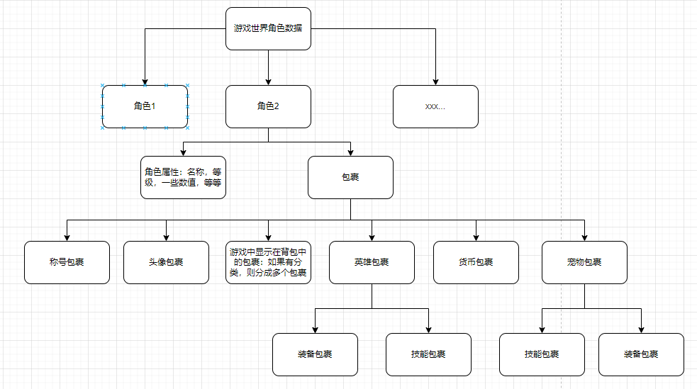

# BagSystem
通用的游戏背包系统

# 前言
在没有真正开发过背包系统时对这个系统存在一定程度的误区，认为只有显示在背包里的才被称之为背包中的道具，然而并非如此，真正游戏开发中会有很多很多模块，例如一个游戏中存在：英雄，小兵，消耗道具，货币，宠物等等，其实都可以存在背包中，如果每个系统都自己管理那么一定有很多重复的增删改查，想想都是一件很恐怖的事情，因此一个好的背包系统需要做到能涵盖游戏中所有存在的物体，需要有一个概念：所有玩家身上存档的东西都是道具或者道具的衍生品。如果分类分的好，连角色本身也是一个道具，衍生开讲英雄可以携带技能，可以携带装备，技能以及装备就是不同的道具，被存在了英雄身上的不同包裹中，以这种思路展开，那么现在游戏中背包的架构如下：



# 道具
## 道具数据结构
加上角色本身，现在游戏中存在8种不同类型的道具，不同类型的道具其数据结构一定是不同的，如下这种方式肯定是不可取的：
```
public class Inventroy
{
    int id;
    string name;
    int level;
    int attack;
    int def;
    //...
}
```
为了能适合所有道具的数据结构一定需要改成可扩展的，如下：
```
public enum ItemKey
{
    Quality = 1, //品质
    Level = 2,   //等级
    Name = 3,    //名称
    Exp = 4,     //经验

    HP = 100,    //血量
    Defense,     //防御
    Attack,      //攻击力
    // ... 等等， 
    // 如血量，防御等词条性质的其实不能简单放在这里，因为存在百分比和直接加成等，当然也可以直接用两个Key分别表示百分比值和加成值。
}

public class Item
{
    /// <summary>
    /// 道具的唯一Id
    /// </summary>
    public ulong id;
    /// <summary>
    /// 道具的配置Id
    /// </summary>
    public int metaId;
    /// <summary>
    /// 道具堆叠数量
    /// </summary>
    public int count;
    /// <summary>
    /// Kv数据:所有道具身上的属性
    /// </summary>
    public Dictionary<ItemKey, long> keyValues;
    /// <summary>
    /// 字符串数据:为了名称等一些字符串的属性，其实除了名称很少有字符串数据，可以把name这个字段拿出来
    /// </summary>
    public Dictionary<ItemKey, string> keyValueStrs;
    /// <summary>
    /// 该道具身上的背包
    /// </summary>
    public Dictionary<BagType, Bag> itemBags;

    // 道具配置
    public ItemConfig itemConfig;
    public bool IsFull => count >= itemConfig.overlayCount;
}
```
除了几个必须存在的字段：唯一Id，配置Id，堆叠数量，其余的所有属性全部放进不同的Map中。以上的数据结构是我在多次小项目中总结，如果有不符合可以自行扩展。上面的BagType，Bag都在下面会讲到。

## 道具配置
在不同项目中难免存在不同的需求，通常在配置方面，我的思路是不动道具配置，而是针对不同类型不同需求的道具另起配置结构，打个比方：如果游戏中存在技能，装备等，技能存在等级1-10级，每级的效果都不一样，装备也存在等级1-10级，每级加成效果都不一样，不可能把这些所有道具的差异性全部往里面塞，而是从其他配置中关联到这个道具Id，如下：
```
// 技能配置
public class SkillConfig
{
    public int id;                  //配置Id
    public int itemId;              //对应的道具Id
    public int level;               //等级

    // 不同的技能效果配置等等
}

// 装备配置
public class EquipConfig
{
    public int id;                  //配置Id
    public int itemId;              //对应的道具Id
    public int level;               //等级

    // 不同的属性加成等等，词条的配置等
}

// 道具配置
public class ItemConfig
{
    public int id;                          //配置Id
    public string name;                     //名称
    public string des;                      //描述
    public string icon;                     //图标
    public string prefabPath;               //预制体路径,掉落显示
    public int overlayCount = 1;            //最大可叠加多少个
    public BagType bagType;                 //背包类型
    public ItemType type;                   //道具类型
    public ItemQualityType qualityType;     //道具品质

    // ... 扩展
}

// 道具类型
public enum ItemType
{
    None,
    // 需要细分，由功能细分，如：强化卷，经验类的，等等主要目的为了筛选方便，以及区分类型
    // 不同类型的装备，不同类型的英雄都需要细分ItemType
}

// 道具品质：通常一个游戏中品质也是共用的
public enum ItemQualityType
{
    Normal = 0,
    Excellent = 1,
    Rarity = 2,
    Legend = 3,
    // ...
}
```
从上面数据结构可以看出，道具配置尽量通用化，而道具特殊性的配置尽量单独提取出来，放到其他配置表中，尽可能不让道具的数据结构存在冗余，存在的每一条字段都是所有道具都需要的。

# 背包
上面讲了道具怎么实现通用和扩展性，下面讲一下背包的实现，首先要明确背包有什么具体功能，除了存储功能，还需要有什么其他功能？举个例子：
1. 每个英雄有3个技能，但同时只可以装备一个技能，英雄的技能从哪里来？可以通过配置表配置3个技能，在获得英雄时，给这个英雄道具的背包上存放这3个技能道具，那么装备了哪个技能这个功能怎么实现？
2. 现在是SLG游戏，玩家一共可以配置x个队伍，每个队伍可以配置一个英雄，n个小兵，且已被配置过的英雄小兵无法使用，又要怎么实现？
1. 思路1：
可以再创建x个背包在人物身上，然后将英雄和小兵从它的背包移到这x个背包中的某一个，但是这样会有一个问题，我在一个英雄图鉴界面，或者其他要展示所有英雄的界面又需要将x个背包的单位全部遍历整合才能得到，而且我的背包数量也会因此变多。
2. 思路2：
在背包里面实现一套穿戴系统，那么任何有用到穿戴/卸下的地方都可以直接在当前背包操作，而且穿戴/卸载其实在很多系统都会或多或少的使用，这里说的穿戴/卸载是一个概念，同类型的都可以这样使用。这样的好处就是所有操作在一个背包中完成，设计上简单了，使用上也不复杂了，不需要整理多个背包。

## 背包的数据结构
上面我们提到现在游戏中存在8种不同类型的道具，分背包类型主要为了方便数据的直接使用，当然你可以把所有道具全部放在一个背包里，使用时再筛选，那样后期管理起来肯定存在一定难度。根据游戏中的UI表现来讲，这n类道具需要分出n个不同背包，分别存放，使用时操作对应背包。不管什么背包在游戏中是什么作用，都不影响他们拥有统一的数据结构。下面我们来看下背包的数据结构：
```
public enum BagType
{
    None,
    Default,    //默认背包(将消耗品,材料等归于一个，如果游戏中是分开显示，那么背包中也分开)
    Role,       //角色
    Hero,       //英雄
    Skill,      //技能
    Equip,      //装备
    Soldier,    //小兵
    Pet,        //宠物
    Currency,   //货币
}
// 背包配置
public class BagConfig
{
    public BagType bagType;     //背包类型
    public int initCapacity;    //初始容量
    // ... 如果游戏中有消耗钻石扩容等，可以配置在这里
}
// 背包实现
public class Bag
{ 
    private BagType _bagType;           //背包类型:通过读取配置表获得容量等
    private List<Item> _slots;          //槽位：如果容量=50，那么_slots.Count=50，允许为空
    private Dictionary<ulong, Item> _allItems;    //所有道具

    //key:穿戴id，value:{key2:穿戴槽位,value2:道具Id}
    private Dictionary<int, Dictionary<int, ulong>> _wears; //多套穿戴

    //key:道具id，value:32位的穿戴id（通常游戏中穿戴几乎不可能>32套）使用二进制节省空间
    private Dictionary<ulong, int> _wearIdRefs;             //判断这个id是否有穿戴

    private int _useWearId;                                 //当前使用了哪套穿戴
}
```
## 背包的功能实现
我们需要实现的背包功能：获得道具，删除道具，扩容，道具移动位置，整理，穿戴，卸下，这些都比较简单，讲一下思路，具体代码看文章底部的项目。
1. 获得道具：先遍历_slots寻找是否有配置Id相同，且没有塞满的，有则放入，没有则找到空槽位放入
```
/// <summary>
/// 获得道具
/// </summary>
public int AcquireItem(int inMetaId, int inAmount = 1, ulong guid = 0, object userData = null);
/// <summary>
/// 获得空格子或者相同的格子
/// </summary>
public bool GetEmptyOrSameSlot(int metaId, out int index)
```
2. 删除道具：遍历_allItems找到配置Id相同的删除指定数量，删除的同时把该道具的穿戴信息清除
```
/// <summary>
/// 删除道具
/// </summary>
public int DelItem(ulong id, int count)
/// <summary>
/// 删除道具
/// </summary>
public int DelItem(int metaId, int count)
```
3. 扩容：修改_slots即可
```
/// <summary>
/// 变化大小
/// </summary>
public void ChangeSize(int size)
```
4. 道具移动位置：_slots中兑换位置即可
5. 整理：清除_slots后，重新走一遍获得道具流程
```
/// <summary>
/// 整理
/// </summary>
public void Sort()
```
6. 穿戴：校验槽位有则替换，将道具Id设置到对应穿戴id+槽位
```
/// <summary>
/// 穿戴
/// </summary>
/// <param name="slot">槽位</param>
/// <param name="id">itemId</param>
/// <param name="wearId">穿戴id（0-31）</param>
public void Wear(int slot, ulong id, int wearId = -1)

/// <summary>
/// 是否穿戴
/// </summary>
public bool IsWear(ulong id, int wearId = -1)
```

7. 卸下：
```
/// <summary>
/// 卸下
/// </summary>
public void UnWear(int slot, int wearId = -1, bool isNotify = true)

/// <summary>
/// 卸下
/// </summary>
public void UnWear(ulong id, int wearId = -1)
```

# 背包管理器
在实现背包以及道具功能后，需要一个管理器管理所有的背包，用统一入口进行道具的增删改查。
这个管理器只需要维护一个RoleItem即可，所有数据全在RoleItem里面。

# 优势
## 存档
按上面的背包系统设计，想要保存角色数据只需要保存RoleItem即可，所有需要存档的数据按理说全部在这个RoleItem上。
```
// json
string json = Newtonsoft.Json.JsonConvert.SerializeObject(BagSystem.Instance.RoleItem);
Debug.Log("存档：" + json);
var jsonRoleItem = Newtonsoft.Json.JsonConvert.DeserializeObject<Item>(json);

// 二进制
BinaryFormatter bf = new BinaryFormatter();
MemoryStream ms = new MemoryStream();
bf.Serialize(ms, BagSystem.Instance.RoleItem);
var array = ms.ToArray();
ms.Seek(0, SeekOrigin.Begin);
var newRoleItem = bf.Deserialize(ms) as Item;
```

# 总结
所有物品都是道具包括经验等特殊道具，这样任何通用的地方都只需要写一套处理道具的方式，试想一下如果把经验，金币，英雄等都分开，他们同时出现在一个通用奖励弹窗里面需要写多少个判断。以上也只是在项目中使用的经验总结，有不对的地方请指出，一起学习，一起进步。